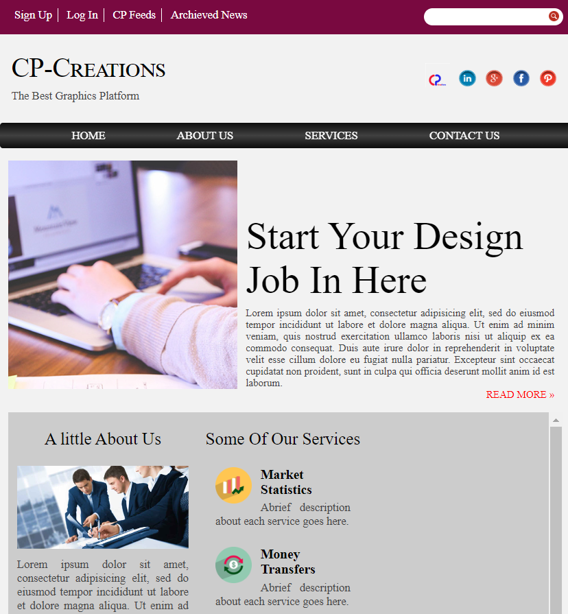

<h1 align="center">
   
  HTML-CSS-Landing-Blog-Page
   
</h1>

<h4 align="center">This is a simple pure HTML, CSS designed landing blog page.</h4>

  
  
   
  <a href="#description">Description</a> 

## Description

